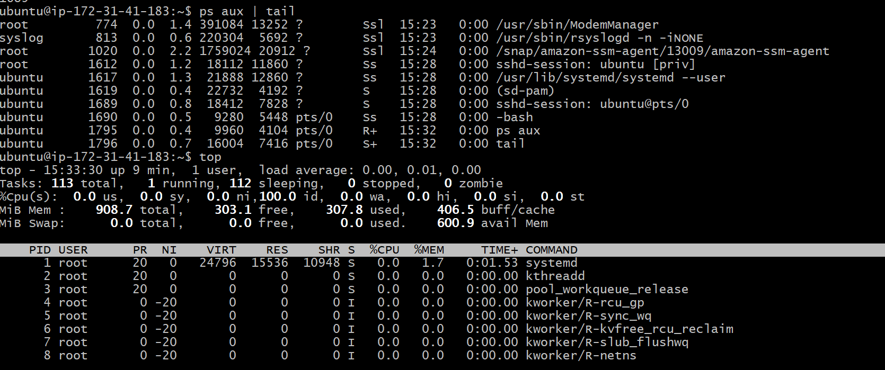
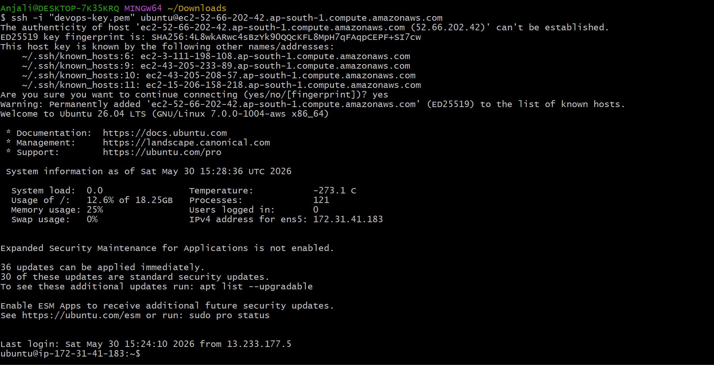
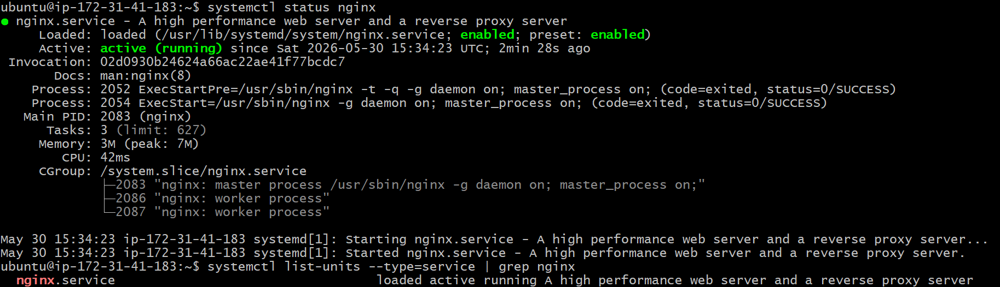
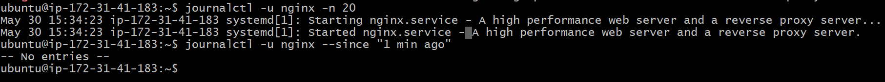

# Day 04 – Linux Practice: Processes and Services

## Overview

Today's goal was to practice basic Linux troubleshooting by checking processes, inspecting services, and reviewing logs.

---

## Process Checks

### Command 1

```bash
ps aux | tail
```

**Observation**

* Displayed running processes on the system.
* Showed information such as PID, CPU usage, memory usage, and command name.

**Screenshot**



### Command 2

```bash
top
```

**Observation**

* Displayed real-time system activity.
* Showed CPU usage, memory usage, running tasks, and system load.

---

## Service Checks

### Service Inspected: SSH

```bash
systemctl status ssh
```

**Observation**

* Verified that the SSH service was active and running.
* Confirmed that remote access to the EC2 instance was available.

**Screenshot**



### Additional Service Check: Nginx

```bash
systemctl list-units --type=service | grep nginx
```

**Observation**

* Confirmed that the nginx service was loaded, active, and running.

**Screenshot**



---

## Log Checks

### Command

```bash
journalctl -u nginx -n 20
```

**Observation**

* Reviewed recent nginx service logs.
* Verified successful service startup events.

**Screenshot**



---

## Mini Troubleshooting Flow

### Scenario

Verify that system services are running correctly.

### Steps Performed

1. Checked running processes using `ps aux` and `top`.
2. Verified SSH service status using `systemctl status ssh`.
3. Confirmed nginx service availability using `systemctl list-units`.
4. Reviewed nginx logs using `journalctl`.
5. Verified that no critical errors were present.

### Result

* SSH service was running successfully.
* Nginx service was active and operational.
* Logs showed successful service startup with no issues observed.

---

## Commands Used

```bash
ps aux | tail
top
systemctl status ssh
systemctl list-units --type=service | grep nginx
journalctl -u nginx -n 20
journalctl -u nginx --since "1 min ago"
```
